# Triport Logistics — Author Blog Management Walkthrough

> **Document Reference:** TL-CMS-AUTH-2026  
> **Target Audience:** Content Authors, Copywriters, and Freight Editors  
> **CMS Platform:** Payload CMS 3.x with PostgreSQL & Cloudflare R2  
> **PDF Guide:** [`docs/Triport_Logistics_Author_Blog_Guide.pdf`](./Triport_Logistics_Author_Blog_Guide.pdf)

---

## 1. Accessing the CMS & Logging In

1. Open your browser and navigate to: **`https://admin.triportlogistic.com/dashboard`**
2. Enter your author credentials:
   - **Email:** `alsaboor02@gmail.com`
   - **Password:** `••••••••••••`
3. Click **Login**.

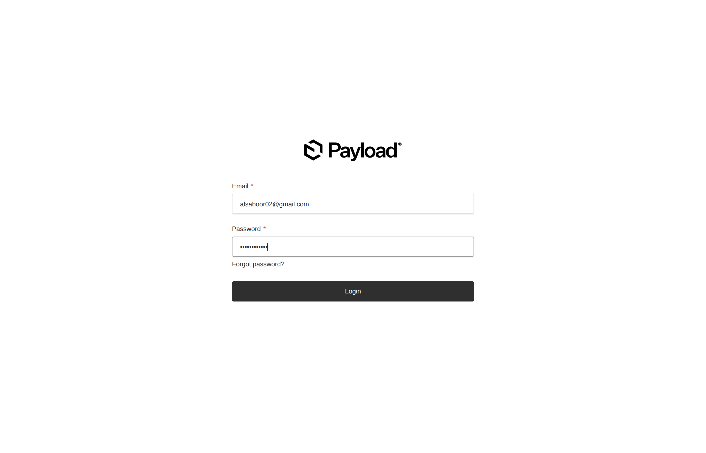

> [!NOTE]
> All legacy URLs (e.g. `/admin`) and root domain requests automatically route to `https://admin.triportlogistic.com/dashboard`.

---

## 2. The Author Dashboard

As an author, you will see a focused workspace designed specifically for writing articles and uploading media:

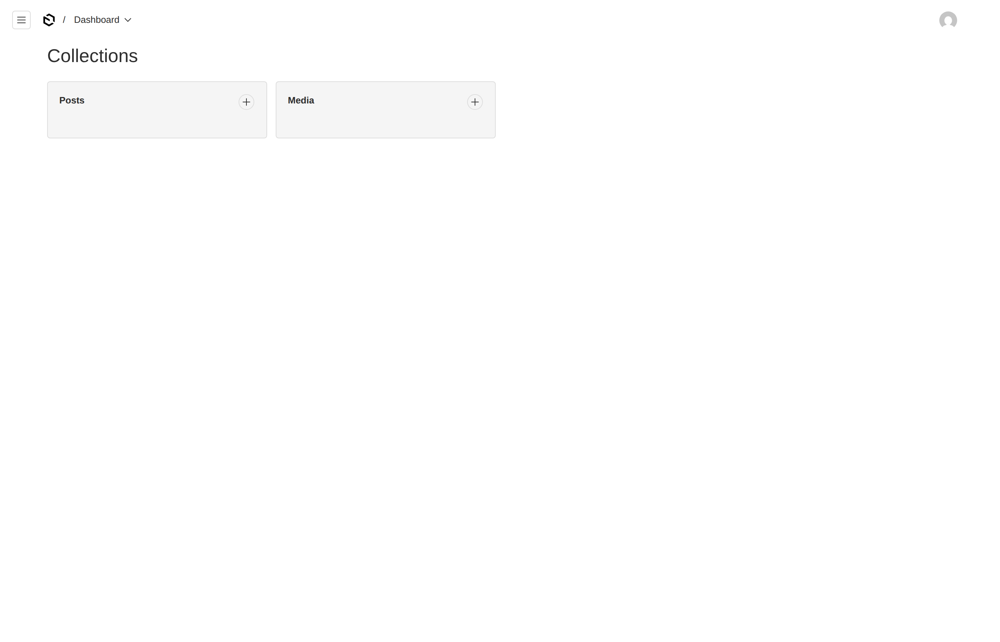

### What Authors See:
- **Posts:** Create, edit, and publish your logistics articles.
- **Media:** Upload photos, banners, and diagrams stored in Cloudflare R2.
- **Access Control:** User administration and global category configurations are protected and managed by system administrators.

---

## 3. Managing the Posts Collection

Clicking **Posts** in the sidebar opens your master article table:

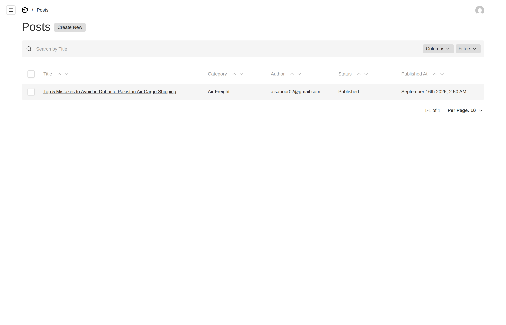

- **Title:** Click on any headline to edit that article.
- **Category:** Topic classification (e.g., *Air Freight*, *Ocean Freight*).
- **Status:** **Draft** (work in progress, private) vs. **Published** (live worldwide).
- **Published At:** Date and time of publication.
- **Create New:** Click the button above the table to start drafting a new post.

---

## 4. Creating a New Blog Article

Click **Create New** to open the two-panel article canvas:

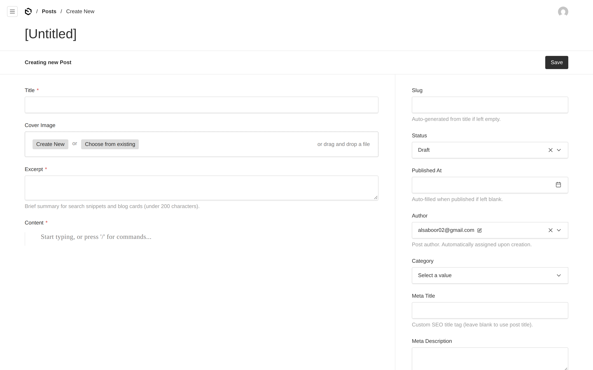

### Field Guide:
1. **Title (Required):** Enter an engaging, keyword-focused headline (e.g., *Top 5 Mistakes to Avoid in Dubai to Pakistan Air Cargo Shipping*).
2. **Slug (Automatic):** Auto-generated from your title (e.g., `top-5-mistakes-to-avoid-in-dubai-to-pakistan-air-cargo-shipping`).
3. **Excerpt (Required):** 1–2 sentences summarizing the article (under 200 characters). This snippet appears on blog listing cards and search engine previews.
4. **Category (Required):** Select the appropriate vertical from the dropdown:

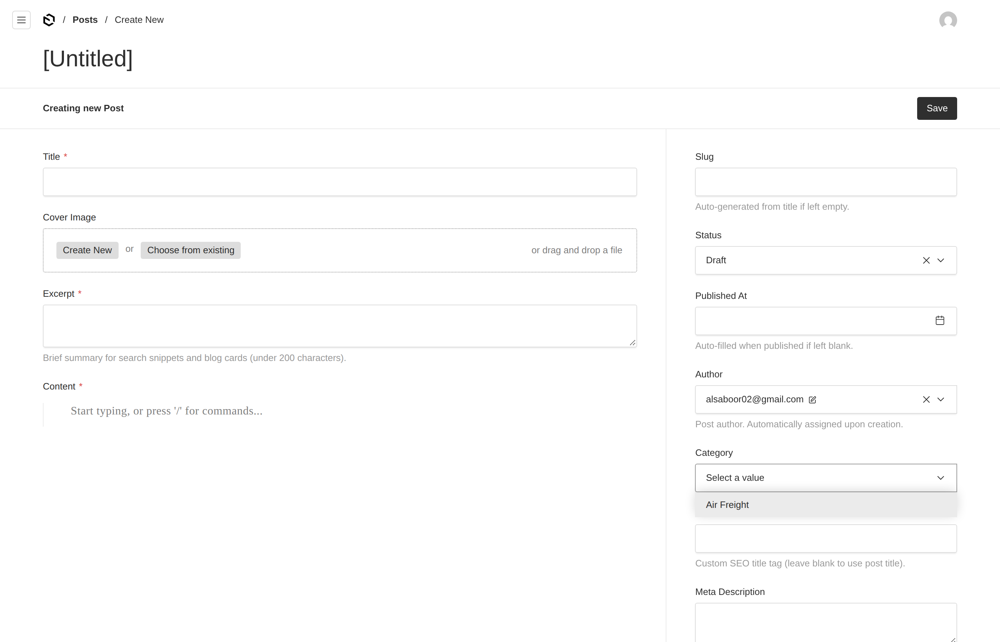

5. **Author:** Automatically assigned to your active account (`alsaboor02@gmail.com`).

---

## 5. Attaching Media & Cloudflare R2

All media uploaded to Triport Logistics is stored in **Cloudflare R2 Object Storage** (`media.triportlogistic.com`).

Click **Choose from existing** to open the media drawer, or click **Create New** to upload from your local machine:

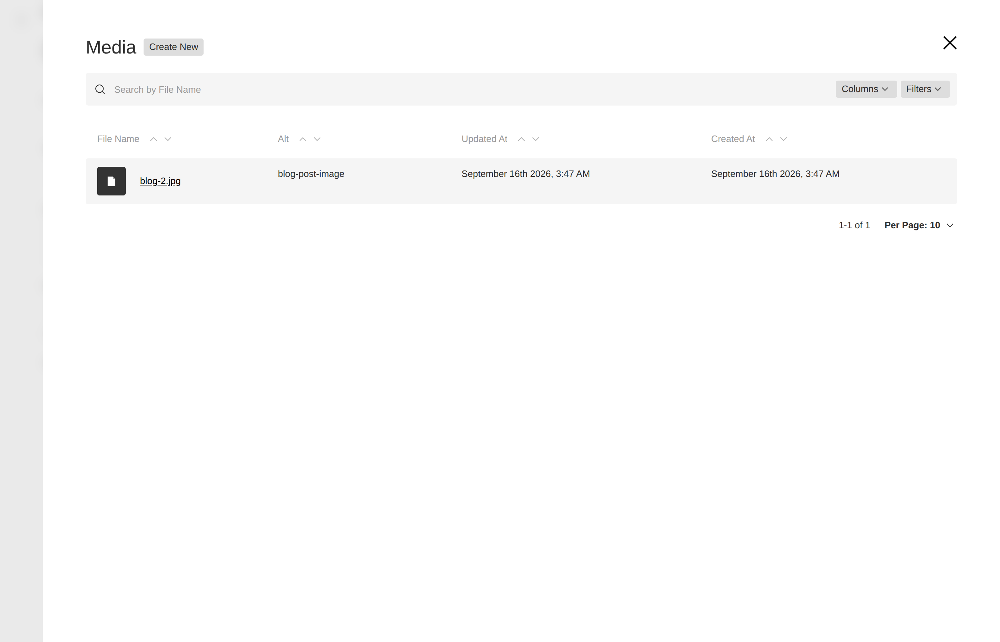

> [!TIP]
> **Cover Image Recommendations:**
> - Resolution: **1200 × 630 px** (16:9 aspect ratio)
> - Format: **WebP**, **JPG**, or **PNG**
> - File Size: Under **300 KB** for fast mobile loading
> - **Alt Text:** Always provide descriptive alt text for accessibility and Google Image SEO.

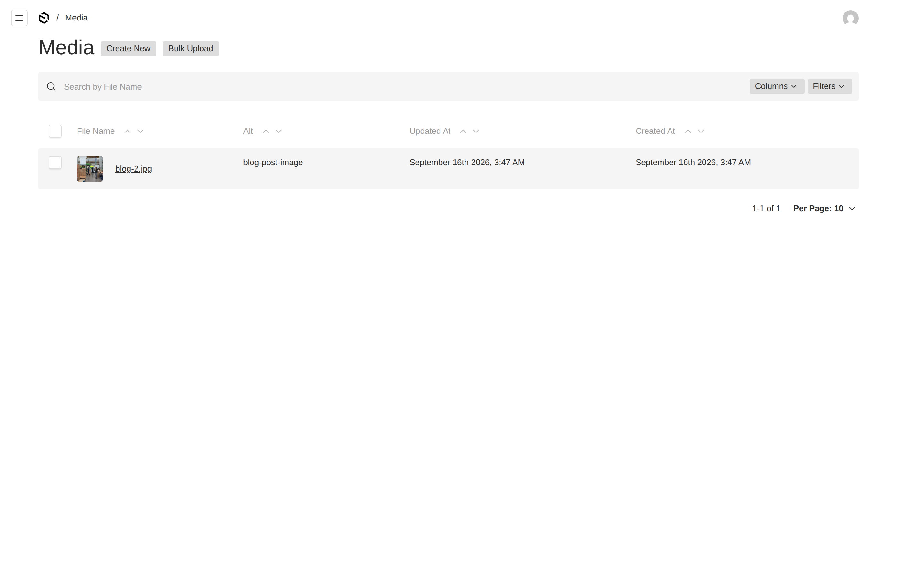

---

## 6. Writing Content with the Rich Text Editor

The body copy is written using the **Lexical Rich Text Editor**:

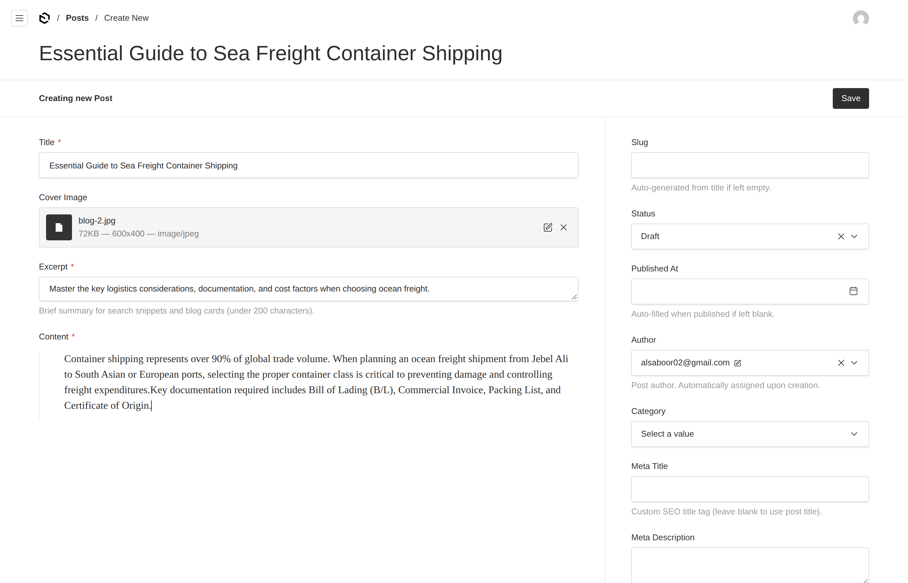

- **Headings (H2, H3):** Structure long articles with clear headings.
- **Bullet & Numbered Lists:** Ideal for customs checklists, transit guidelines, and tariff regulations.
- **Hyperlinks:** Highlight text and add links to relevant Triport service pages or external shipping authorities.
- **Slash Commands:** Type `/` on an empty line for quick insertion options.

---

## 7. Search Engine Optimization (SEO)

Fill out the SEO fields in the right sidebar to optimize your article for search engines:

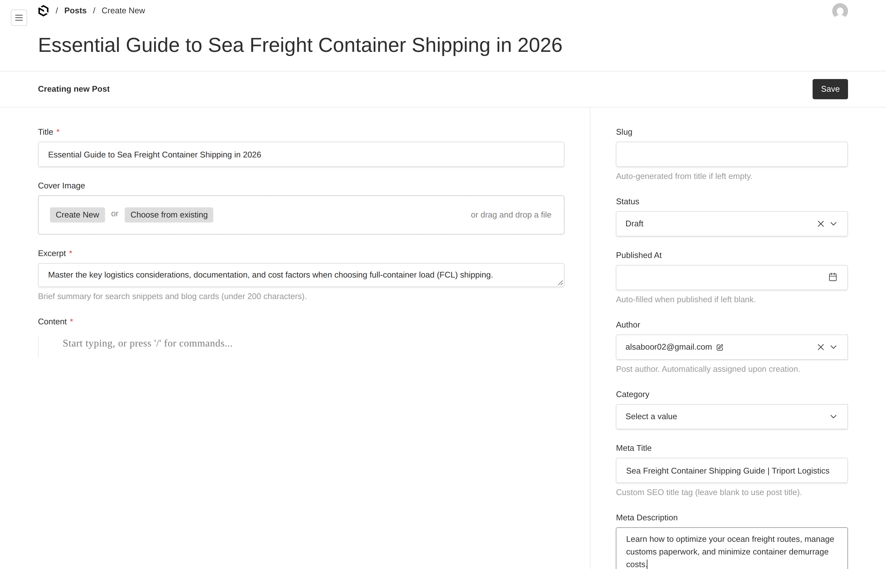

| Field | Recommended Length | Best Practice |
| :--- | :--- | :--- |
| **Meta Title** | 50–60 characters | Include primary keyword + brand name (e.g., `Sea Freight Guide \| Triport Logistics`) |
| **Meta Description** | 140–160 characters | Compelling summary with a clear call to action |
| **Social Card (Open Graph)** | Automatic | Generated from your Cover Image, Title, and Excerpt |
| **Dynamic Sitemap** | Automatic | Added to `https://www.triportlogistic.com/sitemap.xml` upon publishing |

---

## 8. Publishing & Instant Cache Regeneration (ISR)

Triport Logistics features **On-Demand Incremental Static Regeneration (ISR)**:

1. In the right sidebar, click **Status** and select **Published**:

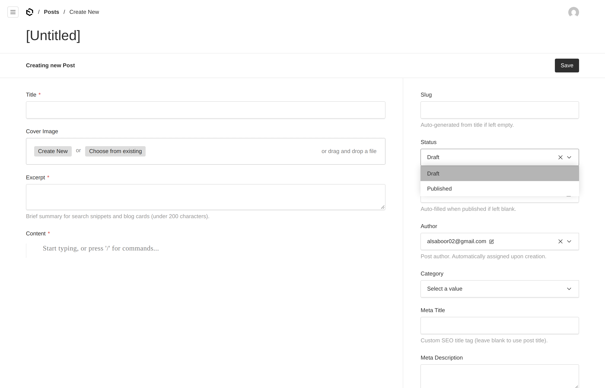

2. Set the **Published At** date (or leave blank to automatically record the current timestamp).
3. Click the solid dark **Save** button in the top right.

> [!IMPORTANT]
> **Zero Deployment Wait Time:** The moment you click Save, on-demand revalidation immediately flushes the cache and serves your fresh post on `https://www.triportlogistic.com/blog` in under **200 milliseconds**!

---

## 9. Verifying the Live Article

### 1. Main Blog Listing
Visit `https://www.triportlogistic.com/blog`:

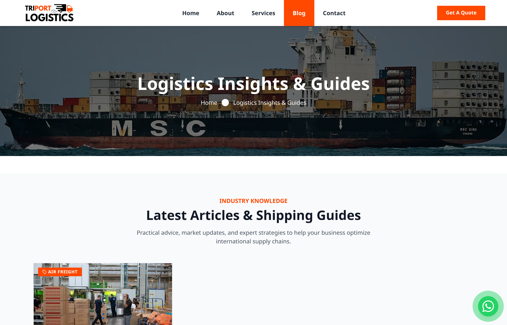

### 2. Full Article Reading View
Click the card or visit `https://www.triportlogistic.com/blog/[your-slug]`:

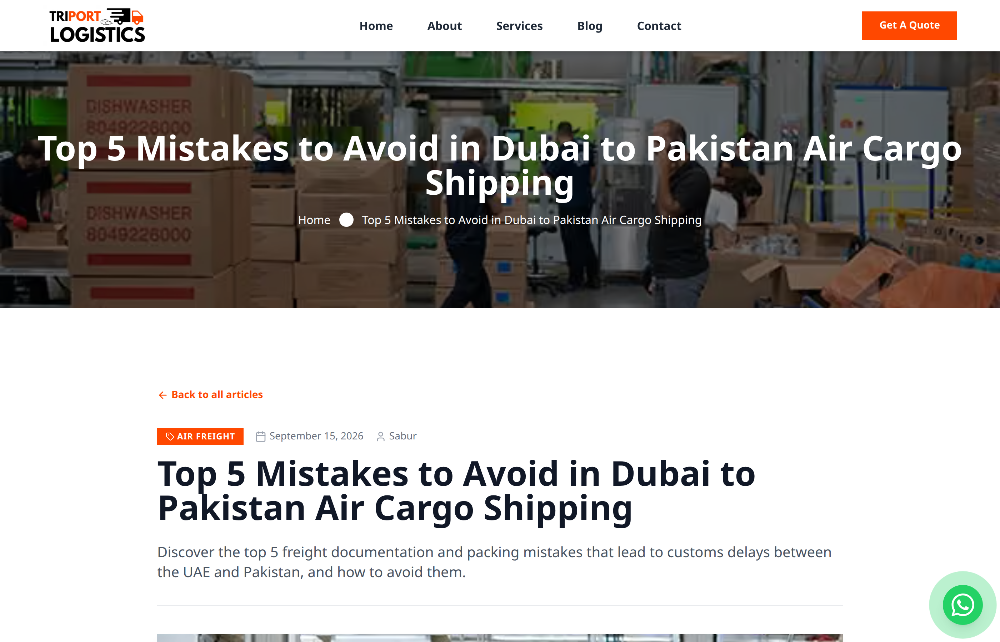

---

## 10. Author Pre-Publishing Checklist

| # | Check Item | Requirement |
| :-: | :--- | :--- |
| 1 | **Headline** | Engaging, freight-relevant, and under 70 characters |
| 2 | **URL Slug** | Clean, lowercase, hyphen-separated |
| 3 | **Excerpt** | Under 200 characters; clear summary of value |
| 4 | **Category** | Selected from available freight verticals |
| 5 | **Cover Image** | High quality (1200×630), under 300 KB, with Alt text |
| 6 | **Formatting** | Clean H2/H3 hierarchy; bullet points for lists |
| 7 | **SEO Title & Desc** | 50–60 char Title, 140–160 char Description |
| 8 | **Status** | Set to **Published** before final Save |

---

## File Locations
- **Print-ready PDF Guide:** [`docs/Triport_Logistics_Author_Blog_Guide.pdf`](./Triport_Logistics_Author_Blog_Guide.pdf)
- **High-Resolution Screenshots:** [`docs/images/`](./images/)

